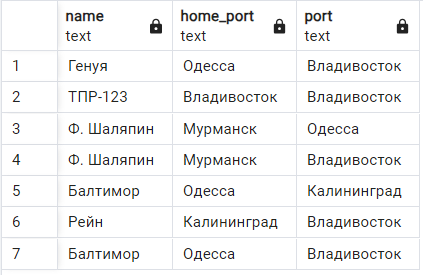
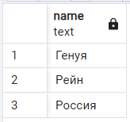

Дружков Матвей 23КНТ2

# Отчет о лабораторной работе №3.
# Вариант 7

## Схема данных.


---
# Задания
## 1. С помощью операторов SQL создать логическую структуру соответствующих таблиц для хранения в СУБД, используя известные средства поддержания целостности (NOT NULL, UNIQUE, и т.д.). Обосновать выбор типов данных и используемые средства поддержания целостности. При выборе подходящих типов данных использовать информацию о конкретных значениях полей БД

### SQL Запрос
```sql
CREATE TABLE IF NOT EXISTS Cargo
(
    id integer NOT NULL,
    name text NOT NULL,
    storage_port text NOT NULL,
    cost integer NOT NULL,
    max_count integer NOT NULL,
    CONSTRAINT "Cargo_pkey" PRIMARY KEY (id)
)

CREATE TABLE IF NOT EXISTS LoadingLocations
(
    id integer NOT NULL,
    pier text NOT NULL,
    port text NOT NULL,
    commision integer NOT NULL,
    CONSTRAINT "LoadingLocations_pkey" PRIMARY KEY (id)
)

CREATE TABLE IF NOT EXISTS Ship
(
    id integer NOT NULL,
    name text COLLATE NOT NULL,
    home_port text,
    privilege integer DEFAULT 0,
    CONSTRAINT ship_pkey PRIMARY KEY (id)
)
CREATE TABLE IF NOT EXISTS Shipment
(
    id integer NOT NULL,
    date text NOT NULL,
    ship_id integer,
    load_loc_id integer,
    cargo_id integer,
    count integer NOT NULL,
    cost integer NOT NULL,
    CONSTRAINT "Shipment_pkey" PRIMARY KEY (id),
    CONSTRAINT cargo_id FOREIGN KEY (cargo_id)
        REFERENCES public."Cargo" (id) MATCH SIMPLE
        ON UPDATE CASCADE
        ON DELETE SET NULL
        NOT VALID,
    CONSTRAINT lloc_id FOREIGN KEY (load_loc_id)
        REFERENCES public."LoadingLocations" (id) MATCH SIMPLE
        ON UPDATE CASCADE
        ON DELETE SET NULL
        NOT VALID,
    CONSTRAINT ship_id FOREIGN KEY (ship_id)
        REFERENCES public."Ship" (id) MATCH SIMPLE
        ON UPDATE CASCADE
        ON DELETE SET NULL
        NOT VALID
)
```

---

## 2. Ввести в ранее созданные таблицы конкретные данные

### SQL Запрос
```sql
INSERT INTO Cargo (id, name, storage_port, cost, max_count) VALUES
(1, 'Рис', 'Одесса', 100000, 700),
(2, 'Зерно', 'Одесса', 80000, 890),
(3, 'Хлопок', 'Одесса', 300000, 400),
(4, 'Сахар', 'Владивосток', 140000, 600),
(5, 'Соль', 'Мурманск', 120000, 700),
(6, 'Скобяные изделия', 'Калининград', 300000, 140),
(7, 'Древесина', 'Мурманск', 400000, 260),
(8, 'Уголь', 'Владивосток', 400000, 400);


INSERT INTO LoadingLocations (id, pier, port, commision) VALUES
(1, 'Северный', 'Одесса', 3),
(2, 'Южный', 'Одесса', 4),
(3, 'N1', 'Владивосток', 2),
(4, 'N2', 'Владивосток', 2),
(5, 'N3', 'Владивосток', 2),
(6, 'Основной', 'Калининград', 4);

INSERT INTO Shipment (id, date, ship_id, load_loc_id, cargo_id, count, cost) VALUES
(70204, 'Понедельник', 001, 005, 002, 100, 8000000),
(70205, 'Понедельник', 003, 003, 006, 4, 1200000),
(70206, 'Вторник', 001, 005, 007, 2, 800000),
(70207, 'Вторник', 002, 005, 001, 20, 2000000),
(70208, 'Вторник', 005, 005, 002, 3, 240000),
(70209, 'Среда', 003, 003, 006, 4, 1200000),
(70210, 'Среда', 004, 001, 001, 70, 7000000),
(70211, 'Среда', 004, 002, 006, 1, 300000),
(70212, 'Среда', 004, 002, 001, 10, 1000000),
(70213, 'Четверг', 001, 006, 003, 20, 6000000),
(70214, 'Четверг', 003, 004, 002, 2, 16000),
(70215, 'Четверг', 004, 003, 004, 30, 4200000),
(70216, 'Суббота', 003, 002, 005, 10, 1200000),
(70217, 'Суббота', 002, 003, 008, 20, 8000000),
(70218, 'Суббота', 001, 001, 001, 20, 2000000),
(70219, 'Суббота', 005, 006, 004, 10, 1400000);


INSERT INTO Ship (id, name, home_port, privilege) VALUES
(1, 'Балтимор', 'Одесса', 3),
(2, 'Генуя', 'Одесса', 3),
(3, 'ТПР-123', 'Владивосток', 5),
(4, 'Ф. Шаляпин', 'Мурманск', 6),
(5, 'Рейн', 'Калининград', 4),
(6, 'Россия', 'Владивосток', 5);
```

---

## 3. Используя оператор SELECT создать запрос для вывода всех строк каждой таблицы. Проверить правильность ввода. При необходимости произвести коррекцию значений операторами INSERT, UPDATE, DELETE.

### SQL Запрос
```sql
SELECT * FROM "Shipment"
```
### Скриншот

```sql
SELECT * FROM "LoadingLocations"
```
### Скриншот

```sql
SELECT * FROM "Cargo"
```
### Скриншот

```sql
SELECT * FROM "Ship"
```
### Скриншот

---

##     4. Создать запросы для вывода:
        a) всех различных названий судов и их льгот;
        b) всех различных адресов приписки судов;
        c) всех различных портов.

### SQL Запрос
```sql
SELECT DISTINCT name,privilege FROM Ship
```
### Скриншот

```sql
SELECT DISTINCT home_port FROM "Ship"
```
### Скриншот

```sql
SELECT DISTINCT port FROM "LoadingLocations"
```
### Скриншот


---
##         5. Создав запрос получить следующую информацию:
        a) название и стоимость грузов, находящихся в количестве менее 500 единиц;
        b) адрес порта, где есть причалы под номерами ( в названии есть “N”) или отчисления на погрузку более 5%;
        c) названия судов из Одессы.

### SQL Запрос
```sql
SELECT name,cost FROM "Cargo" WHERE max_count < 500
```
### Скриншот

```sql
SELECT DISTINCT port FROM "LoadingLocations" WHERE pier LIKE '%N%' OR commision > 5
```
### Скриншот

```sql
SELECT name FROM "Ship" WHERE home_port = 'Одесса'
```
### Скриншот


---
## 6. На основании данных о погрузке вывести все данные в таком формате:
        a) номер ведомости, дата, название судна, стоимость. Отсортировать по дате и названию судна;
        b) название судна, дата, название места погрузки, груз.

### SQL Запрос
```sql
SELECT shment.id, shment.date, s.name, shment.cost FROM "Shipment" shment JOIN "Ship" s
ON s.id=shment.ship_id ORDER BY shment.date, s.name
```
### Скриншот

```sql
SELECT s.name, shment.date, ll.port , shment.cargo_id FROM "Shipment" shment JOIN "Ship" s
ON s.id=shment.ship_id JOIN "LoadingLocations" ll ON ll.id = shment.load_loc_id
```
### Скриншот


---

##     7. Вывести:
        a) названия судов, производивших погрузку в тех чужих портах, где отчисления на погрузку более 3%. Вывести с названиями этих портов и именами причалов. Отсорировать  по портам;
        b) названия и адреса приписки судов, перевозивших (грузивших) зрузы со стоимостью более 50000 ед. не позднее марта месяца. Вывести вместе с названиями портов;
        c)  название и стоимость грузов, которые грузили на “Геную”  на причалах, где отчисления на погрузку более 2%;
        d)  название судов, производивших погрузку более чем в одном порту. Добавить названия портов.

### SQL Запрос
```sql
SELECT DISTINCT
    s.name,ll.port, ll.pier
FROM 
    "Shipment" sh
JOIN 
    "Ship" s ON sh.ship_id = s.id
JOIN 
    "LoadingLocations" ll ON sh.load_loc_id = ll.id
WHERE ll.port <> s.home_port AND ll.commision > 3
ORDER BY ll.port
```
### Скриншот

### Не позднее пятницы
```sql
SELECT DISTINCT
    s.name,s.home_port, ll.port
FROM 
    "Shipment" sh
JOIN 
    "Ship" s ON sh.ship_id = s.id
JOIN 
    "LoadingLocations" ll ON sh.load_loc_id = ll.id
WHERE sh.cost > 50000 AND sh.date <> 'Суббота' AND sh.date <> 'Воскресенье'
```
### Скриншот

### SQL Запрос
```sql
SELECT
    c.name,sh.cost, ll.port
FROM 
    "Shipment" sh
JOIN 
    "Ship" s ON sh.ship_id = s.id
JOIN 
    "LoadingLocations" ll ON sh.load_loc_id = ll.id
JOIN "Cargo" c ON sh.cargo_id = c.id
WHERE s.name = 'Генуя' AND ll.commision > 2

```
### Скриншот

```sql
SELECT
    s.name, ll.port
FROM 
    "Shipment" sh
JOIN 
    "Ship" s ON sh.ship_id = s.id
JOIN 
    "LoadingLocations" ll ON sh.load_loc_id = ll.id
GROUP BY s.id, s.name, ll.port
HAVING COUNT(DISTINCT ll.port) > 1;

```
### Скриншот


---

## 8. Создать запрос для модификации всех значений столбца с суммарной величиной стоимости таблицы погрузка, чтобы он содержал истинную оплачиваемую сумму ( с учетом льгот у судов). Вывести новые значения.

### SQL Запрос
```sql
UPDATE "Shipment" sh
SET cost = cost * (1 - (SELECT privilege / 100.0 
                         FROM Ship s
                         WHERE s.id = sh.ship_id))
WHERE EXISTS (SELECT 1 
              FROM Ship s
              WHERE s.id = sh.ship_id);
```
```sql
SELECT * FROM "Shipment";
```
### Скриншот


---
## 9. Расширить таблицу с данными о погрузке столбцом, содержащим величины отчислений на погрузку. Создать запрос для ввода конкретных значений во все строки таблицы

### SQL Запрос
```sql
ALTER TABLE Shipment
ADD COLUMN loading_fee DECIMAL(10, 2);
```
```sql
UPDATE Shipment sh
SET loading_fee = cost * 
	(SELECT ll.commision::float / 100 FROM LoadingLocations ll WHERE ll.id=sh.load_loc_id)

WHERE EXISTS (SELECT 1 
              FROM public."LoadingLocations" ll 
              WHERE ll.id=sh.load_loc_id);
```
---
##     10. Используя операцию IN (NOT IN)  реализовать следующие запросы:
        a) найти суда не производившие погрузки на причалах Владивостока;
        b) найти грузы, которые грузили на суда из Одессы после понедельника в количестве более 10 единиц;
        c) запрос задания 7.а и 7.с.

### SQL Запрос
```sql
SELECT *
FROM "Ship" s
WHERE s.id NOT IN (
    SELECT DISTINCT sh.ship_id
    FROM "Shipment" sh
    JOIN "LoadingLocations" ll ON sh.load_loc_id = ll.id
    WHERE ll.port = 'Владивосток'
);
```
### Скриншот

```sql
SELECT DISTINCT c.id, c.name
FROM "Cargo" c
WHERE c.id IN (
    SELECT sh.cargo_id
    FROM "Shipment" sh
    JOIN "Ship" s ON sh.ship_id = s.id
    WHERE s.home_port = 'Одесса'
      AND sh.date <> 'Понедельник'
      AND sh.count > 10
);
```
### Скриншот

```sql
SELECT DISTINCT s.name, ll.port, ll.pier
FROM "Shipment" sh
JOIN "Ship" s ON sh.ship_id = s.id
JOIN "LoadingLocations" ll ON sh.load_loc_id = ll.id
WHERE ll.port NOT IN (
      SELECT DISTINCT ll_inner.port
      FROM "LoadingLocations" ll_inner
      WHERE ll_inner.commision <= 3 OR ll.port = s.home_port
  )
ORDER BY ll.port;
```
### Скриншот

```sql
SELECT
    c.name,sh.cost, ll.port
FROM 
    "Shipment" sh
JOIN 
    "Ship" s ON sh.ship_id = s.id
JOIN 
    "LoadingLocations" ll ON sh.load_loc_id = ll.id
JOIN "Cargo" c ON sh.cargo_id = c.id
WHERE s.name = 'Генуя' AND ll.id IN  ( SELECT id FROM "LoadingLocations" WHERE commision > 2)
```
### Скриншот


---
##         11. Используя операции ALL-ANY реализовать следующие запросы:
        a) определить порт приписки судна, производившего самую дорогую погрузку в среду;
        b) какие грузы грузились на суда из Владивостока в количестве более 20 единиц;
        c) найти причал с наименьшими отчислениями среди тех, на кторых проходила погрузка со стоимостью более 500000руб. не менее двух раз;
        d) запрос задания 7.b.

### SQL Запрос
```sql
SELECT s.home_port FROM "Shipment" sh JOIN "Ship" s ON s.id = sh.ship_id
WHERE sh.date = 'Среда'AND sh.cost >= ALL (SELECT sh2.cost FROM "Shipment" sh2 WHERE sh2.date = 'Среда')
```
### Скриншот

```sql
SELECT DISTINCT c.name FROM "Cargo" c JOIN "Shipment" sh ON c.id = sh.cargo_id
JOIN "LoadingLocations" ll ON sh.load_loc_id = ll.id
WHERE ll.port = 'Владивосток' AND sh.count = ANY (SELECT sh2.count FROM "Shipment" sh2 WHERE sh2.count > 20);
```
### Скриншот

```sql
SELECT ll2.pier FROM "LoadingLocations" ll2 WHERE ll2.commision <= ALL(SELECT ll.commision
FROM "Shipment" sh
JOIN "LoadingLocations" ll ON sh.load_loc_id = ll.id
WHERE sh.cost > 500000 GROUP BY ll.id HAVING COUNT(1) > 2) AND ll2.id IN (SELECT ll.id
FROM "Shipment" sh
JOIN "LoadingLocations" ll ON sh.load_loc_id = ll.id
WHERE sh.cost > 500000 GROUP BY ll.id HAVING COUNT(1) > 2)
```
### Скриншот

```sql
SELECT DISTINCT
    s.name,s.home_port, ll.port
FROM 
    "Shipment" sh
JOIN 
    "Ship" s ON sh.ship_id = s.id
JOIN 
    "LoadingLocations" ll ON sh.load_loc_id = ll.id
	WHERE sh.cost > 50000 AND sh.date = ANY (SELECT DISTINCT sh2.date FROM "Shipment" sh2 WHERE sh2.date <> 'Суббота' AND sh2.date <> 'Воскресенье')
```
### Скриншот



---
##         12. Используя операцию UNION получить порты приписки судов и места складирования грузов.

### SQL Запрос
```sql
SELECT home_port FROM "Ship" UNION SELECT storage_port FROM "Cargo";
```
### Скриншот


---

##             13. Используя операцию EXISTS ( NOT EXISTS ) реализовать нижеследующие запросы. В случае, если для текущего состояния БД запрос будет выдавать пустое множество строк, требуется указать какие добавления в БД необходимо провести.
        a) найти места погрузки, на которых проходила погрузка всех судов из Одессы или Мурманска до пятницы;
        b) какие суда проходили погрузку на всех причалах не более раза;
        c) найти грузы, которые грузились на все суда с иным портом приписки чем порт складирования этого груза;
        d) какие грузы грузлись на суда из Владивостока только причалах Одесского порта со вторника по четверг.

### SQL Запрос
```sql
SELECT DISTINCT ll.pier, ll.port
FROM "LoadingLocations" ll
WHERE EXISTS (
    SELECT 1
    FROM "Ship" s
    WHERE (s.home_port = 'Одесса' OR s.home_port = 'Мурманск')
      AND EXISTS (
          SELECT 1
          FROM "Shipment" sh
          WHERE sh.ship_id = s.id
            AND sh.date <> 'Суббота' AND sh.date <> 'Воскресенье'
            AND sh.load_loc_id = ll.id
      )
);
```
### Скриншот

```sql
SELECT s.name FROM "Ship" s WHERE NOT EXISTS(
        SELECT 1
        FROM "Shipment" sh
		WHERE sh.ship_id = s.id
        GROUP BY sh.load_loc_id HAVING COUNT(1) > 1
)
```
### Скриншот

```sql
SELECT c.id, c.name
FROM "Cargo" c
WHERE NOT EXISTS (
    SELECT 1
    FROM "Ship" s
	JOIN "Shipment" sh ON sh.ship_id = s.id AND sh.cargo_id = c.id
    WHERE s.home_port = c.storage_port
);
```
### Скриншот

```sql
SELECT DISTINCT c.name
FROM "Cargo" c
WHERE EXISTS (
    SELECT 1
    FROM "Shipment" sh
    JOIN "Ship" s ON sh.ship_id = s.id
    JOIN "LoadingLocations" ll ON sh.load_loc_id = ll.id
    WHERE s.home_port = 'Владивосток' AND c.id = sh.cargo_id
      AND ll.port = 'Одесса'
      AND (sh.date = 'Вторник' OR sh.date = 'Среда' OR sh.date = 'Четверг')
)

```
### Скриншот

### Т.к запрос выдает пустую строку то выходом был бы запрос на погрузку товара в одессе со вторника по четверг на судно из владивостока, например:
```sql
INSERT INTO Shipment (id, date, ship_id, load_loc_id, cargo_id, count, cost) VALUES
(70220, 'Среда', 3, 2, 5, 100, 8000000);
```
---
##                 14. Реализовать запросы с использованием аггрегатных функций:
        a) найти среди тех судов, которые производили погрузку во всех портах, такие, которые имеют льготы меньше среднего;
        b) определить число причалов в порту Владивосток;
        c) найти среднюю стоимость погрузки на причалах Одесского порта;
        d) найти суммарную стоимость погрузок, произведенных судами в чужих портах.

### SQL Запрос
```sql
SELECT s.id, s.name
FROM "Ship" s
WHERE s.privilege < (
    SELECT AVG(privilege)
    FROM "Ship"
)
AND s.id IN (
    SELECT sh.ship_id
    FROM "Shipment" sh
    JOIN "LoadingLocations" ll ON sh.load_loc_id = ll.id
    GROUP BY sh.ship_id
    HAVING COUNT(DISTINCT ll.port) = (SELECT COUNT(DISTINCT port) FROM "LoadingLocations")
);
```
### Скриншот

```sql
SELECT COUNT(DISTINCT ll.pier)
FROM "LoadingLocations" ll
WHERE ll.port = 'Владивосток';
```
### Скриншот

```sql
SELECT AVG(sh.cost)
FROM "Shipment" sh
JOIN "LoadingLocations" ll ON sh.load_loc_id = ll.id
WHERE ll.port = 'Одесса';
```
### Скриншот

```sql
SELECT SUM(sh.cost)
FROM "Shipment" sh
JOIN "Ship" s ON sh.ship_id = s.id
JOIN "LoadingLocations" ll ON sh.load_loc_id = ll.id
WHERE ll.port <> s.home_port;
```
### Скриншот

---
##                     15. Используя средства группировки реализовать следующие запросы:
        a) определить суда, у которых стоимость самой дорогой погрузки в понедельник или во вторник не превышала 100000;
        b) определить для каждого дня недели число произведенных погрузок на причалах Владивостока;
        c) для каждой пары “груз-место погрузки” с совпадающим портом складирования и портом погрузки, вывести суммарную величину стоимостей погрузок;
        d) для каждого груза определить количество различных судов, на которые грузили этот груз после понедельника.

### SQL Запрос
```sql
SELECT s.name
    FROM "Shipment" sh
	JOIN "Ship" s ON s.id = sh.ship_id
    WHERE sh.date IN ('Понедельник', 'Вторник')
	GROUP BY s.id HAVING MAX(sh.cost) <= 100000    
```
### Скриншот

```sql
SELECT sh.date, COUNT(*) AS loading_count
FROM "Shipment" sh
JOIN "LoadingLocations" ll ON sh.load_loc_id = ll.id
WHERE ll.port = 'Владивосток'
GROUP BY sh.date;
```
### Скриншот

```sql
SELECT c.name, ll.port AS loading_port, SUM(sh.cost)
FROM "Shipment" sh
JOIN "Cargo" c ON sh.cargo_id = c.id
JOIN "LoadingLocations" ll ON sh.load_loc_id = ll.id
WHERE c.storage_port = ll.port
GROUP BY c.name, ll.port;
```
### Скриншот

```sql
SELECT c.name AS cargo_name, COUNT(DISTINCT sh.ship_id)
FROM "Shipment" sh
JOIN "Cargo" c ON sh.cargo_id = c.id
WHERE sh.date <> 'Понедельник'
GROUP BY c.id;
```
### Скриншот

---